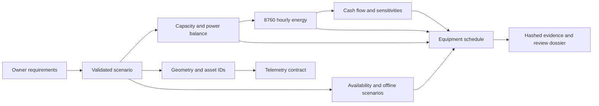

# Architecture

The scenario is the numerical source of truth. Human requirements explain intent; calculations generate evidence; drawings and telemetry share asset IDs. Generated artifacts are committed only for the reference scenario so a reviewer can inspect results without executing code.

`dcf.config` rejects invalid units-domain values and cross-field inconsistencies. `engineering` returns named quantities rather than positional arrays. `energy` preserves gross facility energy separately from grid imports; solar never reduces PUE's numerator. `finance` reruns energy for each distinct occupancy before applying economic drivers. `geometry` owns rack identity; `cli` exports that same identity to telemetry.

All core outputs are deterministic for a configuration, input site table, Python implementation and random seed. `manifest.json` hashes each evidence artifact. The separate configuration digest records original scenario bytes. Generated documents are publication snapshots, not hidden runtime dependencies.

## Design decisions

1. **Building boundary:** model servers only as power/heat/space interfaces. Do not add cloud architecture, GPU purchasing or workload revenue to facility CAPEX.
2. **Original portable core:** standard-library Python is sufficient for screening. High-fidelity solvers remain optional and carry explicit licensing and calibration requirements.
3. **Conservative electrical allowance:** each A/B path can support full facility demand with one local capacity unit unavailable. A shared cooling loop remains a common-mode exposure.
4. **Explain uncertainty:** dimensionally correct calculations are not field validation. Every report carries the concept status and synthetic-data provenance.
5. **Evidence before maturity:** a status can be promoted only with reviewed outputs, versioned input data and acceptance criteria. A folder or a diagram does not count as completed engineering.
