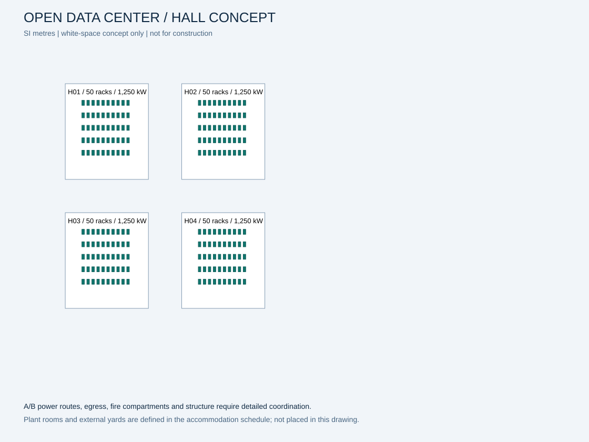

# Open Data Center Facility

**A reproducible, building-only data center engineering portfolio.**

From investment assumptions to equipment capacity, energy, asset identities and commissioning evidence: one scenario drives the complete concept study. Created by **Jonathan Oktaviano** for public engineering learning and contribution.



**Reference:** 5 MW design IT · four halls · 200 racks · A/B electrical paths · air and liquid cooling · synthetic tropical climate.

This is an independent portfolio, with no affiliation, endorsement or proprietary design from AWS or any other hyperscaler. Its maturity is **concept engineering**. It is not a certified facility design, coordinated BIM model, construction package, or validated CFD result.

## Start in two minutes

Python 3.11 or later; no runtime dependencies. Run from this repository's root:

```bash
python -m dcf.cli validate
python -m dcf.cli run --output build/reference
python -m unittest discover -s tests -v
python scripts/verify_repository.py
```

Windows users can substitute `py -3` for `python`. Installing the package is optional: `python -m pip install -e .`, then `dcf run`. Commands assume the repository root as working directory.

## Review the work

| Audience | Entry point |
|---|---|
| Recruiter / portfolio reviewer | [Portfolio dossier](deliverables/facility-portfolio.pdf), [executive memo](00_executive/investment-memo.md) |
| Engineer | [Design basis](01_requirements/design-basis.md), [methodology](docs/model-methodology.md), [requirements traceability](01_requirements/traceability.csv) |
| Analyst | [Editable engineering and finance workbook](deliverables/facility-model.xlsx), [cash-flow method](03_financial-model/README.md) |
| Researcher | [Evidence synthesis](research/research-synthesis.md), [source register](research/source-register.md), [integration contracts](integrations/README.md) |
| Operator | [Commissioning plan](15_commissioning/commissioning-plan.md), [operations handbook](16_operations/README.md) |
| Contributor | [Contributing](CONTRIBUTING.md), [architecture](ARCHITECTURE.md), [maturity map](docs/maturity.md), [PDF publication style](docs/publication-style.md) |

## What runs today

- Validated capacity and conservative per-path N+1 screening for UPS, transformers, generators, chillers and CDUs; battery and BESS energy allowances.
- Reproducible 8,760-hour power/thermal balance, monthly tariffs, energy-weighted PUE, direct-site WUE, grid-carbon and optional PV self-consumption.
- Fifteen-year, pre-tax, unlevered facility cash flows, CAPEX/OPEX, NPV, conventional IRR, gross lifecycle cost and nine sensitivity cases.
- Eligibility-gated site ranking, analytical and seeded Monte Carlo availability, six offline supervisory scenarios.
- Original SVG/DXF rack layout, OpenUSD rack massing, matching asset schedule and synthetic telemetry.

The workbook is an editable companion for design sizing and financial analysis. Its imported occupancy-specific energy results are clearly identified; use Python to regenerate them after changing physical assumptions.

## Repository map

```text
00_executive/          Charter, investment memo, concept feasibility
01_requirements/       OPR, design basis, assumptions, traceability
02_site-selection/    Gated site-screening and due diligence
03_financial-model/   Cost allowances, model conventions, sensitivities
04_architecture/      Systems, interfaces, maintainability
05_electrical/        Concept SLD, sizing and study specifications
06_mechanical/        Air/liquid cooling and loop concept
07_energy/            Metering, hourly balances, PV/BESS boundaries
08_cad-bim/           Geometry basis and accommodation schedule
09_cfd/               Airflow baseline and CFD validation specification
10_control-system/   BMS/EPMS points, alarm and control narrative
11_digital-twin/      Asset/telemetry contract and USD example
12_dcim/              Asset lifecycle and capacity reconciliation
13_reliability/       FMEA, common-cause model, maintenance matrix
14_sustainability/   Carbon, water, lifecycle boundaries
15_commissioning/    FAT/SAT/IST evidence and offline cases
16_operations/       SOP/MOP/EOP, maintenance and dashboard specification
17_delivery/         Procurement, construction and handover gates
18_assurance/        Safety, fire, security and code-review registers
dcf/                 Dependency-free calculation library and CLI
configs/ data/       Versioned scenario and synthetic input records
schemas/ tests/      Input contract and meaningful model tests
research/            Primary sources, evidence gaps and synthesis
integrations/        Optional external simulation workflows
artifacts/reference/ Reproducible CSV/JSON/SVG/DXF/USD evidence
deliverables/        Portfolio PDF and editable workbook
docs/ scripts/       Methods, contribution workflow and verification
```

Read the [Getting Started guide](docs/GETTING-STARTED.md). Original project material is released under [MIT](LICENSE); upstream works retain their own terms. No vendor logos, drawings or proprietary standards are included.
